# GeoAgent

Built for the **Taskmaster** track of the **All Things Agentic Hackathon**,
hosted by **Google**. GeoAgent uses Gemini, Google's Agent Development Kit
(ADK), and Google Cloud.

**GeoAgent** is an autonomous multi-agent system for planning and coordinating real-world operations using organizational data and live geospatial intelligence.

A user connects their operational data, creates a Mission with a simple business objective, and GeoAgent determines how to investigate the available information, evaluate constraints, use geographic context, and produce an operational plan.

For example:

> Plan tomorrow's deliveries.

The user specifies the outcome. GeoAgent determines the relevant resources, locations, deadlines, routes, risks, calculations, and follow-up actions.

## Synthetic demo data

Generate the reproducible Kerala goods-transport SQLite database from the repository root:

```bash
python backend/demo_data/build_demo_db.py --planning-date 2026-08-25
```

The generated `backend/data/geoagent_demo.db` is intentionally gitignored. Its committed schema and builder contain synthetic organizational records only; routes and Mission outputs are produced by GeoAgent rather than stored in the source database.

## Frontend command center

The `frontend` directory is the React, TypeScript, Vite, and Tailwind command
center. It reads only the GeoAgent API; it contains no seeded operational
locations, routes, vehicles, or simulated activity.

```bash
cd frontend
pnpm install
copy .env.example .env.local
pnpm dev
```

Set `VITE_API_BASE_URL` to the FastAPI service (local default:
`http://localhost:8000`) and set `VITE_GOOGLE_MAPS_API_KEY` to a browser key
limited to the Maps JavaScript API. The map reports a configuration state
instead of substituting fake geography when the key is absent.

### Using the Mission command center

Select a Mission to switch the map and right-side **Mission intelligence**
panel to that objective. The map shows real locations and returned route
polylines as they become available; click a location marker to inspect it, and
click a resource card in **Plan** to highlight that resource's route and stop
sequence. **All map** returns to the active-Mission overview.

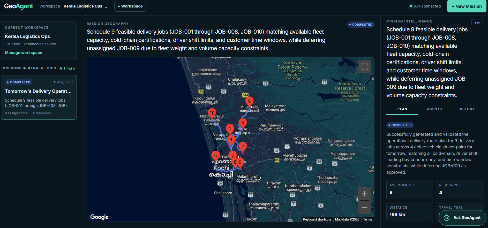

The **Plan** tab gives the operational summary: assignment/resource/distance/
travel-time tiles, availability of locations/routes/validation, the complete
published plan, and one card per assigned resource. A resource card lists its
ordered work; selecting it focuses the associated map route.

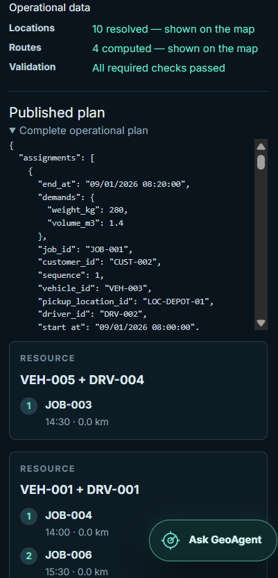

Validation and warnings appear only when they add an operational decision:

- **Validation** exposes hard failures such as an overloaded resource, an
  unavailable/certification-ineligible resource, a breached shift or customer
  time window, or an unassigned required task.
- **Warnings / risks** keep feasible-plan concerns such as traffic leaving no
  deadline buffer, near-full capacity, severe weather, or an approved deferred
  non-critical task. Low-signal geocoding notices are kept in agent activity,
  not presented as an operational risk.

For a completed plan with no hard violations or material risks, the concise
"All required checks passed" state is shown once in **Operational data**.

The **Agents** tab is the safe live observability view: Manager/specialist
delegations, model requests, tool calls, structured results, and failures. It
never exposes private chain-of-thought.

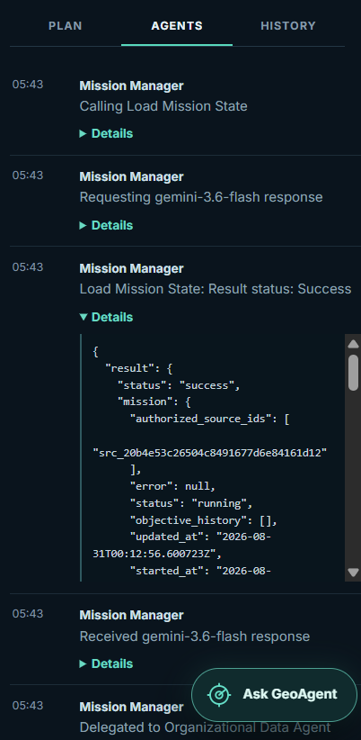

The **History** tab records lifecycle events (creation, start, clarification,
objective decisions, publishing, and failures) and aggregate/latest-run
metrics: agent delegations, tool calls, Gemini/model requests and failures,
runtime, and token totals. It is the audit trail for how the Mission reached
its present state.

The floating **Ask GeoAgent** panel is Workspace-wide Q&A, not a second
Mission. Its read-only Master Operations Agent can answer questions across
persisted Missions about plans, status, validation, safe agent metadata, and
connected data-source metadata; it cannot modify Missions or read source rows.

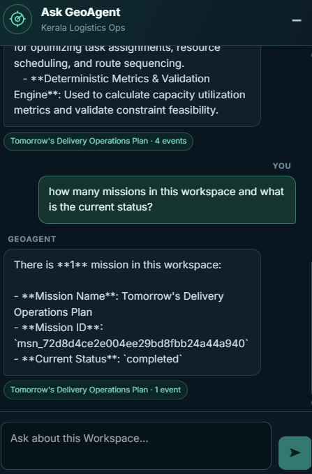

## Connect a SQLite source

Start the API from `backend` after configuring `.env`:

```bash
uvicorn geoagent.app:app --reload
```

Create a Workspace:

```bash
curl -X POST -H "Content-Type: application/json" -d '{"name":"Kerala Operations"}' http://localhost:8000/api/workspaces
```

Copy the returned `workspace_id`, then connect a real SQLite file to it:

```bash
curl -F "name=Kerala Operations" -F "file=@backend/data/geoagent_demo.db" http://localhost:8000/api/workspaces/<workspace_id>/data-sources/sqlite
```

Local development stores uploaded sources under `backend/data/sources`. Set `GEOAGENT_SOURCE_STORAGE=gcs` and `GEOAGENT_SOURCE_BUCKET` in Cloud Run; connection metadata is always stored under the Workspace in the named Firestore database `geoagentdb`.

## Workspace and Mission workflow

A Workspace holds connected organizational data and can contain multiple independent Missions. Connecting a source does not start planning.

GeoAgent has no user accounts or profiles. ADK requires an internal `user_id`, so GeoAgent uses the Workspace ID only to keep each Workspace's sessions isolated.

```text
Create or open a Workspace
  -> connect one or more organizational data sources
  -> enter one Mission objective
  -> optionally limit which connected sources the Mission may use
  -> create the Mission and its persistent ADK session
  -> start the Mission's planning run
  -> Mission Manager coordinates the specialist agents
  -> receive a clarification question, an objective decision, or a completed plan
```

If the user does not select sources, the new Mission is authorized to use all currently connected sources in that Workspace. The backend saves those authorized source IDs with the Mission so later source connections do not silently change an existing Mission.

Workspaces own their sources and Missions. A non-running Mission may be deleted through `DELETE /api/workspaces/{workspace_id}/missions/{mission_id}`. Deleting a Workspace uses `DELETE /api/workspaces/{workspace_id}` with `{"workspace_name":"<exact workspace name>"}` and removes its source files, source metadata, Missions, map state, safe events, and internal ADK sessions. A Workspace with a running Mission cannot be deleted.

Starting a Mission is a planning action, not execution of the real-world operation. The backend deliberately uses two operations:

```text
POST /api/workspaces/{workspace_id}/missions
  -> saves the initial Mission and its persistent ADK session

POST /api/workspaces/{workspace_id}/missions/{mission_id}/run
  -> starts the Mission Manager for that saved Mission
```

During backend testing, these production endpoints are called directly. The
frontend uses both operations when the user presses **Start Mission**.

## Cloud Run deployment

Production uses one Cloud Run service. Its container builds the Vite command
center and serves it from FastAPI, so the browser UI and `/api/*` share one
origin and deploy atomically in one revision.

### Production services

| Google Cloud service | GeoAgent responsibility |
|---|---|
| Cloud Run | Runs the single public FastAPI + React container. |
| Cloud Build | Builds the container from the current local repository source. |
| Artifact Registry | Stores immutable Cloud Run container images. |
| Firestore Native (`geoagentdb`) | Stores Workspaces, Missions, plans, safe events, and ADK sessions. |
| Cloud Storage | Stores uploaded SQLite organizational sources durably. |
| Secret Manager | Injects the server-side Gemini and Maps credentials; values are never committed. |
| Cloud Logging | Captures deployment and runtime logs for operational evidence. |
| IAM service account | Gives the Cloud Run revision only its Firestore, source-bucket, and required-secret access. |

### Deployed infrastructure evidence

The following screenshots show the deployed Google Cloud resources that support
the live GeoAgent service.

**Cloud Run service and ready revision**

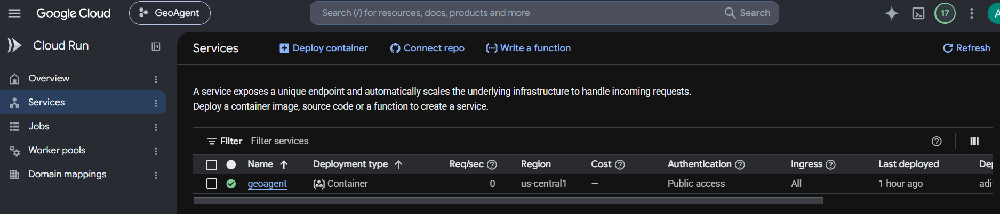

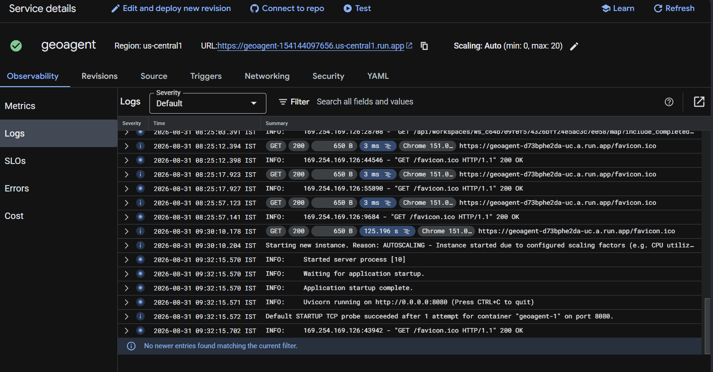

**Container image, application state, and source storage**

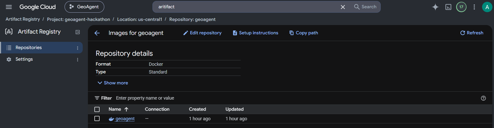

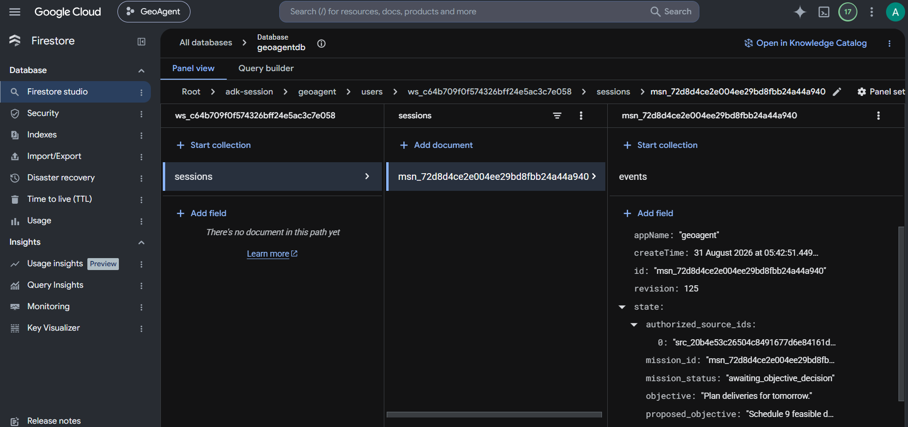

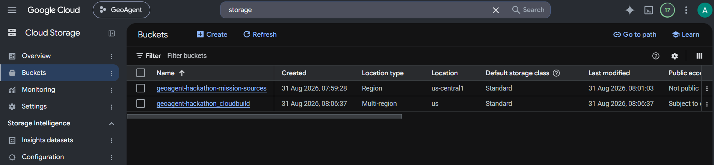

**Runtime observability**

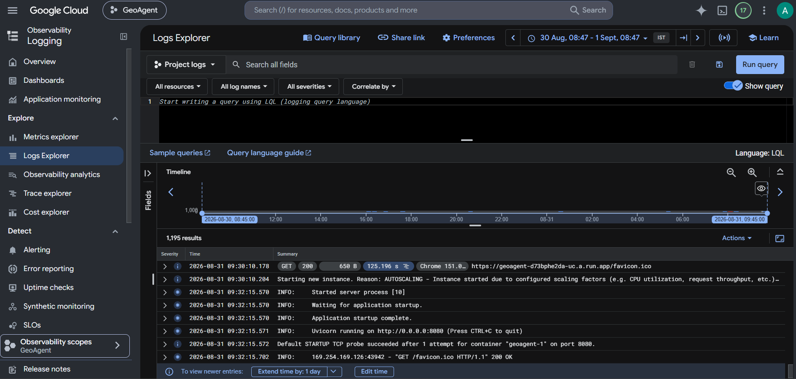

The deployed application calls Gemini through Google ADK and calls Google Maps
Platform APIs for browser maps and mission-specific geospatial work. Browser
and server Maps keys are separate: the browser key is referrer- and API-
restricted, while the server key is stored only in Secret Manager and limited
to the backend APIs it calls.

The deployed service requires these non-secret environment settings:

- `GOOGLE_CLOUD_PROJECT=geoagent-hackathon`
- `FIRESTORE_DATABASE_ID=geoagentdb`
- `GEOAGENT_SOURCE_STORAGE=gcs`
- `GEOAGENT_SOURCE_BUCKET=<production bucket>`
- `GEOAGENT_CORS_ORIGINS=<Cloud Run service origin>`

`GOOGLE_API_KEY` and the server-side `GOOGLE_MAPS_API_KEY` must be attached
from Secret Manager. The frontend uses a separate `VITE_GOOGLE_MAPS_API_KEY` at
image-build time; it is necessarily browser-visible and must be restricted to
the deployed HTTPS referrer. Use an empty `VITE_API_BASE_URL` for the
single-service deployment so browser requests remain same-origin.

The Cloud Run service account needs least-privilege access to the named
Firestore database, the source bucket, and the attached Secret Manager secrets.
It must not use a local source directory in production. Cloud Run logs are the
deployment and runtime evidence; Scheduler and Trace are not required for the
current feature set.

`Dockerfile` defines the combined application image and `cloudbuild.yaml`
builds it from local source. A normal release builds a new immutable image in
Cloud Build and deploys that image as the next Cloud Run revision; the public
service URL remains stable and Cloud Run retains prior revisions for rollback.

### Planned extension: scheduled disruption monitoring

This is **not part of the implemented hackathon demo**. For active Missions,
Google Cloud Scheduler could periodically invoke the Cloud Run backend to run a
Disruption Monitoring Agent. It would combine Maps/Routes conditions, weather,
official emergency or news feeds, and authorised organizational-data changes
into a structured assessment of location, severity, affected resources/routes,
and expected Mission impact. Material assessments would be passed to the
Mission Manager for targeted reassessment and replanning; updated state would
remain in Firestore and uploaded SQLite sources in Cloud Storage.

```text
Cloud Scheduler → Cloud Run → Disruption Monitoring Agent → live data/tools
→ structured disruption assessment → Mission Manager → replanning → Firestore
```

This is scheduler-based periodic monitoring (cron-style), **not event-driven**.
It is deliberately deferred because a four-minute demo is not a practical
window to wait for a scheduled check, observe a new disruption, and show the
resulting autonomous replan. Cloud Scheduler is therefore proposed only; it is
not one of the Google Cloud services currently used by deployed GeoAgent.

### Clarification and impossible-Mission decisions

The Mission Manager starts by loading the Mission. If the objective is genuinely
too vague to act on, it asks **one concise open-ended question** before it
delegates work. It does not ask questions while a specialist is working. A short
objective such as `Plan tomorrow's deliveries.` is actionable and proceeds
without a question.

When clarification is needed, the Mission enters `awaiting_input`. The answer
resumes the same Mission and ADK session; the Manager combines it with the
original objective and continues without asking a second initial question.

If the specialists and deterministic validation show that the objective is not
possible, this is not treated as a clarification. The Manager saves the reasons
and one achievable replacement objective, then the Mission enters
`awaiting_objective_decision`.

```text
User chooses Accept and Replan
  -> original objective is kept in Mission history
  -> proposed objective becomes the current objective
  -> one new planning attempt runs
  -> if still impossible, stop and ask for another explicit decision

User chooses Discard Mission
  -> Mission, its product events, and its ADK session are deleted
```

The two API actions are:

```text
POST   /api/workspaces/{workspace_id}/missions/{mission_id}/objective-decision/accept
DELETE /api/workspaces/{workspace_id}/missions/{mission_id}/objective-decision
```

A completed Mission stores its plan and frontend-safe events in Firestore.

### Ask GeoAgent workspace Q&A

The floating **Ask GeoAgent** widget uses one read-only ADK Master Operations
Agent to answer questions across the current Workspace's persisted Missions.
It can compare lifecycle status, objectives, plans, assignments, metrics,
validation, warnings, failures, and safe recorded agent activity. It cannot
query connected organizational sources or create, modify, delete, resume, or
rerun a Mission.

```text
POST /api/workspaces/{workspace_id}/questions
  -> receives one question plus bounded browser-memory history
  -> creates one temporary in-memory ADK session
  -> reads current Mission documents and safe Mission events
  -> returns an answer with validated Mission/event references
  -> deletes the temporary session before returning
```

Chat messages remain only in React memory. Minimizing the widget preserves the
visible conversation, while a Workspace switch or browser refresh clears it.
The backend does not create a chatbot collection or persistent ADK session,
returns `Cache-Control: no-store`, and disables GenAI message-content capture
in telemetry.

### Live map projection

Each Mission also stores a compact, frontend-ready `map_state`. It is a
projection of safe, normalized tool results rather than a second agent plan:
geocoding contributes locations, Routes contributes real encoded polylines,
optimization contributes assignments, and deterministic tools contribute metrics
and validation. It never copies raw organizational query rows or hidden model
reasoning.

The frontend can poll these endpoints while the existing `/run` request remains
in progress:

```text
GET /api/workspaces/{workspace_id}/missions/{mission_id}/map
  -> selected Mission locations, routes, assignments, metrics, validation, warnings,
     availability flags, revision, and final-state marker

GET /api/workspaces/{workspace_id}/map?include_completed=false
  -> representative locations for active Missions; set include_completed=true for history
```

`map_state.revision` increases only when a real map-relevant tool result is
persisted or the Manager publishes the plan. `availability` explicitly reports
whether locations, routes, assignments, metrics, or validation have not yet
been requested, are available, or were unavailable. A Mission may therefore
have a partial or empty map without the UI inventing geography.

For local Vite development, set `GEOAGENT_CORS_ORIGINS` to an explicit,
comma-separated list of browser origins (the default is
`http://localhost:5173`). Set the deployed frontend origin explicitly for
Cloud Run; wildcard origins are not used.

## Firestore structure

Firestore alternates between collections, which contain records, and documents, which contain fields and may have child collections. GeoAgent uses this structure:

```text
workspaces                                      collection
└── {workspace_id}                              Workspace document
    ├── data_sources                            collection
    │   └── {source_id}                         source metadata document
    └── missions                                collection
        └── {mission_id}                        Mission document
            └── events                          collection
                └── {event_id}                  frontend-safe activity document

adk-session                                     ADK-managed collection
└── geoagent                                    application document
    └── users                                   ADK-managed collection
        └── {workspace_id}                      session-isolation document
            └── sessions                        ADK-managed collection
                └── {mission_id}                persistent ADK session document
                    └── events                  ADK execution-history collection
```

The Mission document is GeoAgent's authoritative product record. It stores the
objective, objective history, authorized source IDs, status, clarification,
pending objective decision, generated name, summary, and final structured plan.
Its `events` collection contains safe agent actions, tool calls, structured
results, and state changes intended for the frontend.

ADK's `adk-session` collection is the manager's persistent working context. GeoAgent reuses the Mission ID as the ADK session ID and uses the Workspace ID as ADK's internal `user_id`; this is session isolation only and does not represent a user account. Some identifiers and initial context appear in both places because the product API and ADK runtime have different storage responsibilities.

Source documents contain connection metadata only. The SQLite database itself stays in `backend/data/sources` during local development and moves to Cloud Storage when the deployed backend uses the GCS storage setting.

## Backend architecture and Mission flow

The backend separates organizational data from GeoAgent's own state:

- **SQLite** holds an organization's operational records.
- **Firestore** holds Workspaces, source metadata, Missions, plans, decisions, and frontend-safe events.
- **Cloud Storage** holds uploaded SQLite files in production; local development uses `backend/data/sources`.
- **ADK session storage** holds the isolated working context for each Mission.

The files are organised by responsibility, not by a strict one-file-per-step
rule. Several files naturally participate in the same request.

| File or folder | Purpose |
|---|---|
| `backend/geoagent/app.py` | FastAPI entry point. Receives Workspace, source, Mission, clarification, objective-decision, and event requests. |
| `backend/geoagent/missions.py` | Core Mission lifecycle: Firestore records/events, ADK sessions/runs, state transitions, clarification resume, objective decisions, and plan persistence. |
| `backend/geoagent/agent.py` | Defines the Manager and three specialist agents, their instructions, schemas, and automatic ADK subagent delegation. |
| `backend/geoagent/mission_manager_tools.py` | The four Manager-only actions: load Mission state, ask the one clarification, request an objective decision, and publish a plan. |
| `backend/geoagent/workspace_qa.py` | Defines the read-only Master Operations Agent, its Workspace-bound tools, bounded request/response schemas, and ephemeral per-request ADK runner. |
| `backend/geoagent/geospatial_tools.py` | Geospatial Agent integrations for Google Maps, Weather, and Roads APIs; normalizes results, provenance, partial failures, and API errors. |
| `backend/geoagent/planning_tools.py` | Planning Agent's domain-neutral optimization, metrics, and validation. Uses local OR-Tools and optionally Route Optimization. |
| `backend/geoagent/data_sources/organizational_data_tools.py` | Organizational Data Agent's authorised source listing, schema inspection, and read-only querying tools. |
| `backend/geoagent/data_sources/source_manager.py` | Coordinates source validation, storage, registration, Mission authorization, and queries. |
| `backend/geoagent/data_sources/sqlite_source.py` | SQLite validation, schema discovery, and constrained read-only query execution. |
| `backend/geoagent/data_sources/source_files.py` | Local or Cloud Storage file handling for uploaded SQLite databases. |
| `backend/geoagent/data_sources/source_records.py` | Firestore persistence for source connection metadata. |
| `backend/geoagent/data_sources/data_source_contracts.py` | Shared validated source, schema, query, result, and error structures. |
| `backend/geoagent/__init__.py` and `backend/geoagent/data_sources/__init__.py` | Python package boundaries and shared exports; no business workflow runs here. |
| `backend/demo_data/build_demo_db.py` | Builds the synthetic Kerala demonstration database; it is not used by the runtime except when creating demo data. |
| `backend/requirements.txt` | Backend Python dependencies. |
| `backend/tests/` | Test files mirror the backend responsibilities: API, Missions, Manager tools, organizational-data tools, geospatial tools, planning tools, source persistence, SQLite adapter, and demo data. |

### Source connection flow

```text
source upload
  -> app.py
  -> source_manager.py
  -> sqlite_source.py validates the database
  -> source_files.py stores the file
  -> source_records.py saves source metadata in Firestore
```

### Multi-agent Mission flow

Each Mission runs one isolated Google ADK collaborative agent team:

```text
Mission Manager
├── Organizational Data Agent
├── Geospatial Intelligence Agent
└── Operational Planning and Validation Agent
```

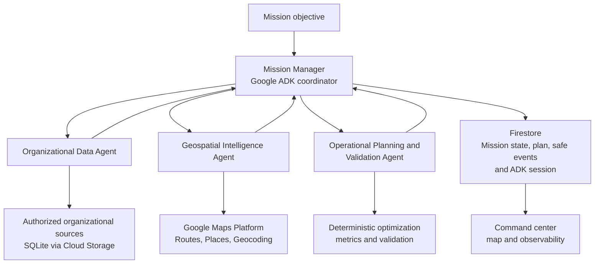

```text
start Mission
  -> app.py calls missions.py
  -> missions.py loads the Mission and starts its saved ADK session
  -> Manager calls load_mission_state
  -> if the objective is genuinely unclear: save one clarification and pause
  -> otherwise ADK automatically delegates to the relevant specialists
       -> Organizational Data Agent reads only authorised source data
       -> Geospatial Agent gets only the needed physical-world context
       -> Planning Agent optimizes, calculates metrics, and validates
  -> Manager receives the structured findings
  -> feasible: Manager publishes the plan to Firestore
  -> impossible: Manager saves one replacement objective and waits for the user
  -> missions.py records safe events throughout; hidden model reasoning is excluded
```

The **Mission Manager** is the user-facing coordinator. It loads Mission state,
decides whether one initial clarification is essential, delegates work, resolves
specialist findings, and publishes a feasible validated plan. If the objective
is impossible, it requests an explicit objective decision instead of retrying
or publishing an invalid plan. Its application tools are `load_mission_state`,
`request_clarification`, `request_objective_decision`, and `publish_plan`; ADK
automatically generates one delegation tool for each declared subagent.

The three specialists are leaf agents using `mode="single_turn"`. They do not interact with the user:

- **Organizational Data Agent:** uses `list_authorized_sources`, `inspect_source_schema`, and read-only `query_source` to discover relevant organizational facts without hard-coded domain schemas.
- **Geospatial Intelligence Agent:** selects only the relevant tools: `geocode_locations`, `search_places`, `compute_routes`, `compute_route_matrix`, `get_weather_context`, and `inspect_roads`. It preserves organizational record IDs, provenance, and per-item failures rather than inventing physical-world facts. Weather is collected for time-bound physical work even when it is informational; Roads is used only for GPS correction, nearest-road, access, or speed-limit needs.
- **Operational Planning and Validation Agent:** uses `optimize_assignments`, `calculate_plan_metrics`, and `validate_plan` to build and check domain-neutral candidate plans. It considers availability, capacities, capabilities, time windows, travel costs, utilization, warnings, and hard violations. `optimize_assignments` uses local OR-Tools by default and may use Google Route Optimization for a compatible vehicle-routing problem; that option uses Application Default Credentials, not the Maps API key. It cannot publish a plan or talk to the user.

For human input, only the Mission Manager may call `request_clarification`.
That action stores the one initial open-ended question, places the Mission in
`awaiting_input`, and stops work until the user responds through the same
Mission session. The Mission runner converts ADK activity into safe agent,
tool, result, and state events without exposing hidden reasoning; event
recording is infrastructure, not an agent-controlled tool.

The separate **Master Operations Agent** is not a Mission subagent. Each
question runs in a short-lived in-memory session seeded with the current
Workspace ID. Its tools can list Mission summaries, load one persisted Mission,
and load capped safe events for one Mission. Workspace identity comes from ADK
tool context rather than model arguments, and returned evidence references are
filtered against records actually retrieved during that invocation.

## Features

- **Mission-based operations:** Each objective runs as its own Mission with isolated state, activity, plan, and multi-agent execution context.
- **Multi-agent planning:** A Mission Manager coordinates capability-based agents for organizational-data investigation, geospatial intelligence, and operational planning/validation.
- **Simple business objectives:** Users describe the desired outcome without needing to understand database schemas, route optimization, or prompt engineering.
- **Flexible organizational data:** Missions work with authorized connected data sources rather than hard-coded domain tables or workflows.
- **Geospatial intelligence:** Google Maps APIs provide geocoding, Places search, routes, travel matrices, selected weather context, and selected road context with provenance.
- **Validated operational plans:** Deterministic tools optimize assignments, calculate metrics, and report hard violations and warnings before the Manager publishes a plan.
- **Mission decisions:** When an objective is impossible, the user explicitly accepts one revised objective for a single new attempt or discards the Mission.
- **Agent observability:** A synchronized activity view shows safe agent lifecycle, delegation, tool, result, validation, and state events without private reasoning.
- **Live operational map and reassessment:** The map shows operational locations, routes, assignments, constraints, disruptions, and plan changes; material changes trigger targeted reassessment and replanning.
- **Parallel Mission isolation:** Multiple active Missions can operate independently while sharing only explicitly authorized organizational data.
- **Cross-Mission operations Q&A:** A Master Operations Agent retrieves and explains persisted state across Missions without merging their private execution contexts.
